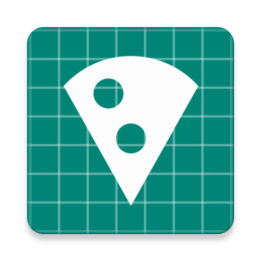
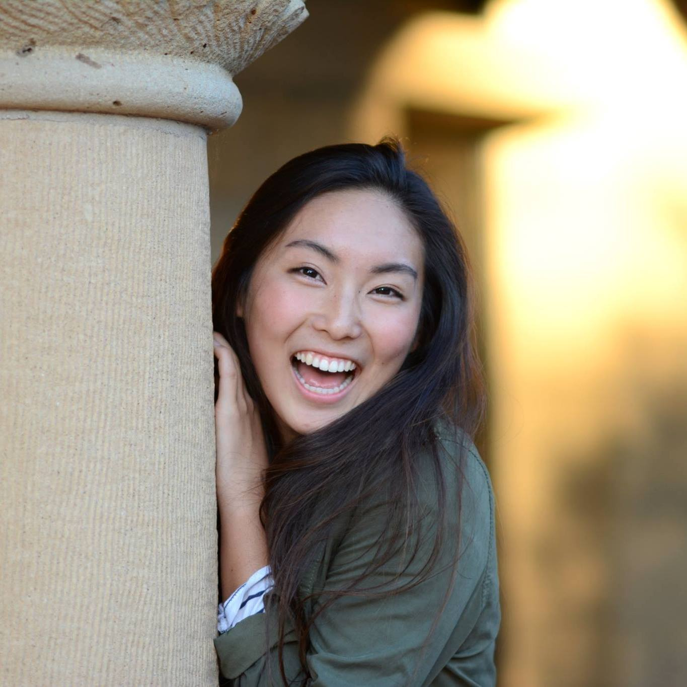
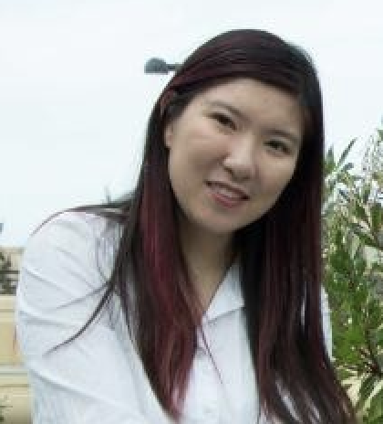
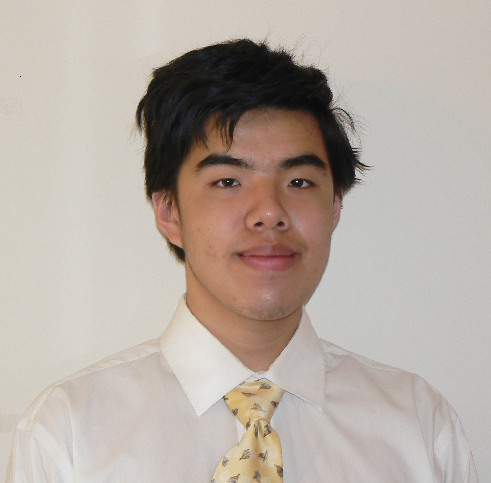
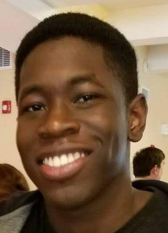

# StanFood

## Project Synopsis
An application to notify people of where free food events are happening on campus.

Rough Implementation Plan:
- Look through free food mail listings to find locations on campus that have free food.
- Allow event organizers to advertise their event (free food) on our app, such that other users can be notified.

## Team Members

Member | Photograph
--- | ---
Rachel Hyon | 
Cindy Jiang | 
James Li | 
Po Tsui | 
Tofe Alimi | 

## Team Skills Matrix
Member | Skills | Personal Traits | Desired Growth | Weaknesses
--- | --- | --- | --- | ---
Rachel | Computer Graphics, Game Dev, Computer Vision, UI design | Team oriented, leadership, decisive, open-minded/open to ideas | Full stack web development | Generating ideas, programming, chocolate
Cindy | Python, AI/ML, backend, Android (minimal), Unity/C# (game dev) | Sensitive to work environment, organized | Communication, frontend, organized documentation | Public speaking, team communication, making decisions, chocolate
James | AI/ML, Python, C++, Math, Robotics Research | Meticulous, detail oriented, time-management | Public speaking, leadership | Decisive leadership, public speaking, lacks impromptu creativity
Po | Full-stack web develpment (142), Java (plus some Android), graphic and UI design | Detail oriented, organized | Public speaking, leadership, backend | Public speaking, making a decision
Tofe | Systems programming, dev-ops, backend development | Abstract thinker, positive attitude, likes food | Planning skills, management, app development | Planning, programming, documentation

## Team Communication
1. [Slack](https://cs-194-workspace.slack.com)
   
2. Emails: rhyon@, cindyj@, dawwctor@, potsui@, oalimi@

3. [Github](https://github.com/orgs/StanfordCS194/teams/team-15/)

4. [Google Drive](https://drive.google.com/drive/u/1/folders/0AIla_VYnIjdDUk9PVA)

5. [SGM Worksheet](https://docs.google.com/forms/d/e/1FAIpQLSc9CVv1vRhA3Gd6R-AKCnXIshWq6vFBQLPXn8Nv4aW3mCHn3w/viewform?usp=sf_link)

## Attributions
Special thanks to Noun Project: Geovani Almeida, Shashank Singh, Eagle Eye, Gregor Cresnar, Icon Lauk, Taylan Sentürk
